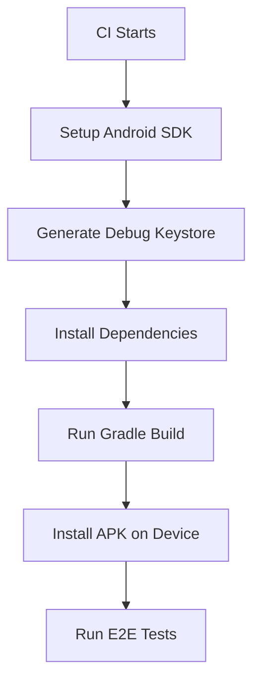

# 🔧 Android Keystore CI/CD Fix

## **Issue Summary**
The CI pipeline was failing with the error:
```
Keystore file '/home/runner/work/vyeya/vyeya/packages/app/android/app/debug.keystore' not found for signing config 'debug'.
```

This happens because Android debug builds require a keystore for signing APKs, but CI environments don't have the debug keystore that's typically generated locally.

---

## **🔄 Solution Implemented**

### **1. Automated Keystore Generation Script**
**File**: `scripts/setup-android-keystore.sh`

This script:
- ✅ Checks if debug keystore already exists
- ✅ Validates existing keystore integrity
- ✅ Generates new keystore if missing or corrupted
- ✅ Uses standard Android debug signing credentials
- ✅ Sets appropriate file permissions

### **2. Enhanced Build Configuration**
**File**: `packages/app/android/app/build.gradle`

Added Gradle task that:
- ✅ Automatically generates keystore before builds
- ✅ Only runs when keystore is missing
- ✅ Integrates with existing build process
- ✅ Uses `preBuild.dependsOn generateDebugKeystore`

### **3. CI Pipeline Integration**
**File**: `.github/workflows/main-ci-cd.yml`

CI stages now include:
- ✅ Keystore generation before Android builds
- ✅ Runs on both mobile builds and E2E test stages
- ✅ Uses the standardized script approach
- ✅ No duplicate keystore generation

### **4. Fastlane Integration**
**File**: `packages/app/fastlane/Fastfile`

Fastlane lanes now:
- ✅ Ensure keystore exists before builds
- ✅ Use helper method `ensure_debug_keystore`
- ✅ Work consistently in local and CI environments
- ✅ Provide clear logging for debugging

### **5. E2E Testing Enhancement**
**File**: `scripts/ci-e2e-tests.sh`

E2E script now:
- ✅ Generates keystore before Android builds
- ✅ Prevents build failures in CI
- ✅ Maintains compatibility with local testing
- ✅ Clear logging for troubleshooting

---

## **🚀 Deployment Strategy**

### **Immediate Fix (Current)**
```bash
# The CI pipeline now automatically:
1. Sets up Android SDK
2. Generates debug keystore if missing
3. Builds Android APK successfully
4. Continues with E2E testing
```

### **Local Development**
```bash
# Developers can manually ensure keystore exists:
./scripts/setup-android-keystore.sh

# Or it happens automatically during:
pnpm android
fastlane android build_debug
```

### **CI Environment**
```yaml
# GitHub Actions workflow now includes:
- name: Generate Android Debug Keystore
  run: ./scripts/setup-android-keystore.sh

# This runs before any Android builds
```

---

## **🔍 Technical Details**

### **Debug Keystore Specifications**
- **File**: `packages/app/android/app/debug.keystore`
- **Store Password**: `android`
- **Key Alias**: `androiddebugkey`
- **Key Password**: `android`
- **Algorithm**: RSA 2048-bit
- **Validity**: 10,000 days
- **Distinguished Name**: `CN=Android Debug,O=Android,C=US`

### **Security Considerations**
- ✅ **Debug only**: Not used for production releases
- ✅ **Standard credentials**: Uses Android default debug signing
- ✅ **Local development**: Same keystore across environments
- ✅ **CI compatibility**: Generated fresh for each build

### **Build Process Flow**


---

## **📊 Impact Assessment**

### **Before Fix**
- ❌ CI builds failing with keystore errors
- ❌ Manual intervention required
- ❌ Inconsistent local vs CI behavior
- ❌ Blocked mobile testing pipeline

### **After Fix**
- ✅ Automated keystore generation
- ✅ Consistent builds across environments
- ✅ No manual intervention needed
- ✅ Reliable mobile CI/CD pipeline
- ✅ Clear error messages and logging

---

## **🧪 Testing Validation**

### **Local Testing**
```bash
# Test keystore generation
./scripts/setup-android-keystore.sh

# Test Android build
cd packages/app && fastlane android build_debug

# Test full E2E pipeline
./scripts/ci-e2e-tests.sh
```

### **CI Testing**
```bash
# Verify in GitHub Actions:
1. Check workflow logs for keystore generation
2. Confirm Android build succeeds
3. Validate E2E tests complete
4. No signing-related errors
```

### **Expected Outputs**
```
🔑 Android Debug Keystore Setup
📁 Working in: /path/to/android/app
✅ Debug keystore generated successfully
🔍 Verifying keystore...
Keystore type: JKS
🎉 Android debug keystore setup complete!
```

---

## **🚨 Troubleshooting**

### **Common Issues**

**Issue**: Keystore generation fails
**Solution**: Check Java/keytool installation
```bash
which keytool
java -version
```

**Issue**: Permission denied on keystore
**Solution**: Script sets correct permissions automatically
```bash
chmod 644 debug.keystore
```

**Issue**: Gradle still can't find keystore
**Solution**: Verify file location and Gradle configuration
```bash
ls -la packages/app/android/app/debug.keystore
```

### **Debug Commands**
```bash
# Verify keystore contents
keytool -list -keystore debug.keystore -storepass android

# Check Gradle tasks
cd packages/app/android && ./gradlew tasks --all | grep keystore

# Test signing configuration
./gradlew assembleDebug --info
```

---

## **🎯 Next Steps**

### **Immediate (Complete)**
- ✅ Keystore generation implemented
- ✅ CI pipeline updated
- ✅ Local development supported
- ✅ Documentation created

### **Future Enhancements**
- 🔄 **Production signing**: Implement secure release keystore management
- 🔄 **Key rotation**: Automated keystore renewal for security
- 🔄 **Multi-flavor support**: Different keystores per build variant
- 🔄 **Security scanning**: Automated keystore validation

---

## **📚 References**

### **Android Documentation**
- [Android App Signing](https://developer.android.com/studio/publish/app-signing)
- [Debug Signing](https://developer.android.com/studio/publish/app-signing#debug-mode)
- [Keystore Generation](https://developer.android.com/studio/publish/app-signing#generate-key)

### **Related Files**
- `scripts/setup-android-keystore.sh` - Keystore generation script
- `packages/app/android/app/build.gradle` - Android build configuration
- `.github/workflows/main-ci-cd.yml` - CI pipeline definition
- `packages/app/fastlane/Fastfile` - Mobile automation configuration

---

**🎉 Android keystore issue resolved!** The CI pipeline now automatically generates debug keystores, ensuring consistent and reliable Android builds across all environments.
